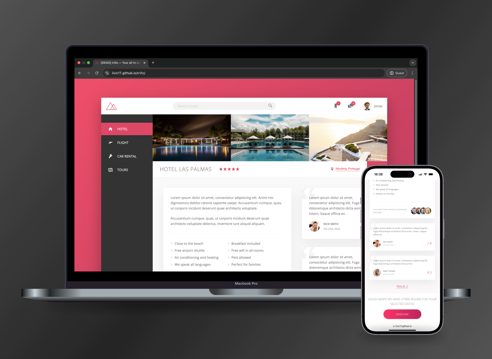

# Trillo

Trillo is a static dashboard snapshot built with **SCSS**, showcasing advanced Flexbox techniques for responsive and modern UI layouts.

## Features

### 🖥️ Advanced SCSS and Flexbox
- **Responsive Layouts:** Utilizes **Flexbox** for adaptive and responsive design across various screen sizes.
- **Custom SCSS Variables:** Centralized styling through variables for consistent colors, spacing, and typography management.
- **Dynamic Components:** Modular SCSS architecture, separating styles into reusable and maintainable chunks.

### 🎨 Interactive UI Design
- **Hover Effects and Transitions:** Smooth interactions and subtle animations for enhanced user engagement.
- **Search Input Focus States:** Transitions that provide visual feedback during user interaction.
- **Notification Badges:** Highlighting unread messages and updates with dynamic badges.

### 📱 Mobile Optimization
- **Media Queries:** Fine-tuned styles for seamless adaptation to smaller screen sizes.
- **Collapsed Navigation:** Adjustments for compact layouts on mobile devices.
